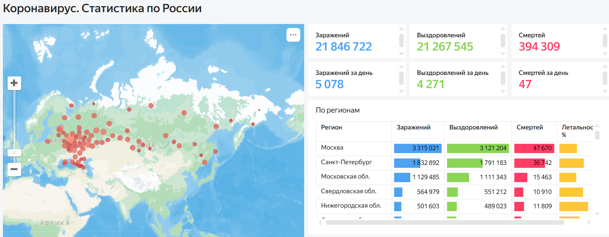
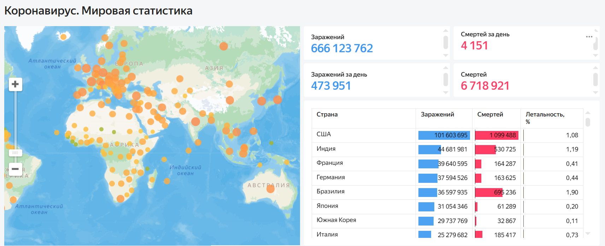

# covid-dashboard-datalens
Учебный проект по визуализации данных COVID-19 в Yandex DataLens

Учебный проект, выполненный в рамках практической работы по Yandex DataLens. Цель проекта — воспроизведение и изучение структуры аналитического дашборда, работа с KPI, картами, таблицами и инструментами визуализации данных. 

В ходе работы были изучены: 
- построение интерактивных карт;
- создание KPI карточек;
- визуализация статистики;
- организация аналитического дашборда.

## Скриншоты

### Статистика по России

### Мировая статистика

